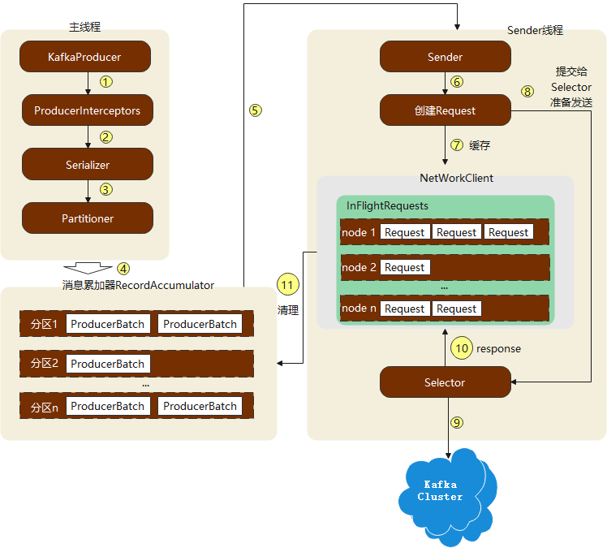
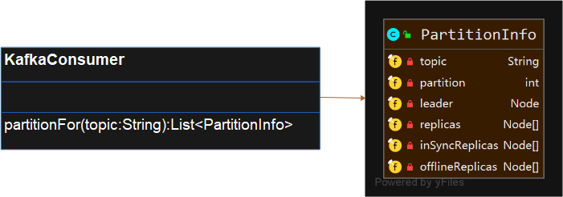

# 初识Kafka

## 基本概念

kafka体系架构


生产者、消费者以及broker的概念。

### 主题和分区

kafka中的消息以主题为单位进行归类。生产者将消息发送到特定的主题，而消费者负责订阅主题并进行消费。

主题是逻辑的概念，它还可以细分为多个分区，一个分区只属于单个主题。分区在存储层面还可以看作一个可追加日志文件，消息在被追加到分区日志文件的时候都会分配一个特定的offset。Kafka通过它来保证消息在分区内的顺序性。

offset不能跨分区。

### 多副本

kafka为分区引入了多副本机制，通过增加副本的数量可以提升容灾能力。副本之间是“一主多从”的关系，其中leader副本负责处理读写请求，follower副本只负责与leader副本的消息同步。当leader出现故障时，从follower副本中重新选举新的leader副本对外提供服务。

follower中的副本会有一定的滞后。


```scala
AR：所有副本的集合。
ISR：所有与leader副本保持一定同步的副本。
OSR：与leader副本同步滞后过多的副本。
注意：同步所允许的滞后程度是可以配置的。
```

leader副本负责维护跟踪ISR集合中所有follower副本的滞后状态，当follower副本落后太多或失效时，那么leader副本会把它从ISR集合中剔除。

如果OSR集合中有副本追上了leader副本，那么leader副本会将他从OSR集合转移到ISR集合。

默认情况下，如果leader副本发生故障，只会从ISR集合中选取新的leader。


```tex
HW：高水位，消费者只能拉取这个offset之前的消息。表示所有副本同步消息到了offset的位置。
LEO：标识当前日志文件中下一条待写入消息的offset。
```

## 安装与配置

## 生产与消费

```shell
kafka-topics.sh --zookeeper bigdata01:2181/kafka --create --topic topic-demo --replication-factor 3 --partitions 3
# --zookeeper 指定了kafka所连接的zk服务地址。
# --topic 指定主题的名称
# --replication-factor 指定副本因子
# --partitions 指定分区数量
# --create 创建主题

kafka-topics.sh --zookeeper bigdata01:2181/kafka --describe --topic topic-demo

kafka-console-producer.sh --broker-list bigdata01:9092 --topic topic-demo

kafka-console-consumer.sh --bootstrap-server bigdata01:9092 --topic topic-demo
```

# Kafka配置

## 服务端配置

[broker配置文件]: config/server.properties

## 生产者配置

[producer配置]: config/producer.properties

## 消费者配置

[consumer配置]: config/consumer.properties

# 生产者

## 开发流程


## ProducerRecord分析


```tex
headers 用来设置一些应用相关的信息。可以不设置
key 指定消息的键值，不仅是消息的附加信息，还可以用来计算分区号。
	同一个key的消息会被发送到同一个分区。
	有key的消息还可以支持日志压缩的功能。
timestamp 消息的时间戳。有CreateTime和LogAppendTime两种类型。
```

## 生产者API

Kafka发送消息主要有三种模式：发后即忘、同步和异步。

KafkaProducer异常类型


对于可重试异常，如果配置了retries参数，那么在规定的重试次数内自行恢复，就不会抛出异常。

### 序列化

Kafka的序列化器都实现了org.apache.kafka.common.serialization.Serializer。

producer内置的序列化器


Serializer的方法


```tex
configure() 配置当前类
serialize() 执行序列化
close() 关闭序列化器
```

生产者的序列化器和消费者的反序列化器一一对应。

查看StringSerializer源码了解序列化器配置。默认使用UTF8的方式进行序列化。

如果Kafka提供的几种序列化器无法满足应用需求，则可以使用Avro、JSON、Thrift、ProtoBuf和Protostuff等通用的序列化工具来实现。或者自定义序列化器。

### 分区器

如果在ProducerRecord中指定了partition字段，那么就不需要分区器的作用。否则依赖分区器，根据key这个字段来计算partition。

接口：org.apache.kafka.clients.producer.Partitioner


```tex
kafka中提供的默认分区器为DefaultPartitioner。 
partition()用来计算分区号。
close()关闭分区时用来回收资源。
configure(Map<String, ?> configs) 获取配置信息及初始化。
```

内置Partitioner


DefaultPartition逻辑：

自定义分区器。

### 生产者拦截器

生产者拦截器可以用来过滤不符合要求的消息，修改消息内容等。也可以用来在发送回调逻辑前做一些定制化的需求。


```tex
消息在序列化和计算分区之前会调用onSend方法。
消息应答之前或者消息发送失败时调用onAcknowledgement方法。这个方法运行在Producer的IO线程中，越简单越好。
```

## 原理分析

### 整体架构



```tex
生产者客户端线程：
	主线程：创建消息，然后通过拦截器、序列化器、和分区器的作用后进入消息累加器（RecordAccumulator）
	Sender线程：从RecordAccumulator中获取消息并发送到Kafka。

RecordAccumulator
	主要用来缓存消息以便Sender线程可以批量发送，进而减少网络传输。
	buffer.memory控制RecordAccumulator缓存的大小。默认32M。
	如果生产者发送消息的速度超过发送到服务端的速度，则可能导致生产者空间不足。此时KafkaProducer的send()方法要么阻塞，要么抛出异常，取决于参数max.block.ms。
	RecordAccumulator内存维护了一个双端队列Deque<ProducerBatch>。消息写入缓存时，追加到队列的尾部；Sender线程从队列的头部读取消息。
	如果生产者需要向很多分区发送消息可以将buffer.memory调大。
	Kafka生产者客户端通过java.io.ByteBuffer实现消息内存的创建和释放。不过频繁创建会比较耗资源。在RecordAccumulator内存还有一个BufferPool，它主要用来复用ByteBuffer。BufferPool只针对特定大小的ByteBuffer进行管理，而其他大小的ByteBuffer不会缓存进BufferPool中。这个大小由batch.size指定。
	
ProducerBatch
	ProducerBatch可以包含一个或多个ProducerRecord。
	ProducerBatch大小与batch.size的关系，当一条消息流入RecordAccumulator时，会先寻找消息分区对应的双端队列（没有则创建），再从双端队列尾部获取一个ProducerBatch（没有则创建）。查看ProducerBatch是否可以写入ProducerRecord，如果可以则写入，如果不可以则新建一个ProducerBatch。在新建ProducerBatch时评估这条消息的大小是否超过batch.size参数大小，如果不超过，则以batch.size大小创建ProducerBatch，这样在使用完之后，可以通过BufferPool进行复用。如果消息大小超过了batch.size，那么就以评估的大小创建ProducerBatch，这段内存不会被复用。
	
	
Sender从RecordAccumulator获取到消息后，将原本<分区, Deque<ProducerBatch>>转为<Node, List<ProducerBatch>>。还会封装为<Node, Request>形式。这里的Request指ProducerRequest。
Sender发往Kafka之前Request还会保存在InFlightRequests中。具体保存形式为Map<NodeId, Deque<Request>>,它主要的作用是缓存了已经发送出去但是还没有收到响应的请求。
InFlightRequests还可以限制每个连接（客户端与Node之间的连接）最多缓存的请求数。这个配置参数为max.in.flight.requests.per.connction。默认值为5。如果堆积了较多未响应的消息。说明Node负载较大，或者网络有问题。继续发送可能会有超时的风险。
```

### 元数据更新

在InFlightRequests中还可以获取leastLoadedNode，即所有Node中负载最小的一个。这里负载最小是通过InFlightRequests中还未确认的请求决定的。选择leastLoadedNode发送请求可以使它尽快发出。

元数据的作用：

leastLoadedNode的概念适用多个场合，比如元数据更新、消费组播协议的交互。

在发送消息时，我们只知道topic，对其他元数据一无所知。bootstrap.servers只需要配置部分broker节点，因为客户端可以自己发现其他broker节点地址，这一过程属于元数据更新。分区数量及leader的变化，客户端也需要动态地捕获这些信息。


## 其他

对于要保证顺序性的场合，需要将max.in.flight.requests.per.connction设置为1，而不是将retries设置为0。因为InFlightRequests每个连接里面如果可以缓存多个Request，可能前一个Request失败，而后面一个Request成功，导致乱序。

# 消费者

## 消费者和消费者组

在kafka的消费理念中还有一层消费者组（Comsumer Group）的概念，每个消费者都有一个对应的消费者组。当消息发布到主题后只会被投递到订阅它的每个消费组中的一个消费者。


## 客户端开发


### 订阅主题和分区


assign订阅


使用assign方法需要获取分区的信息。



取消订阅


```tex
取消subscribe和assign订阅的主题。
可通过assign和subscribe订阅空的集合完成取消订阅。
```

***通过subscribe订阅主题具有再均衡的功能，assign没有。***

### 反序列化

Kafka内置的反序列化器：


查看StringDeserializer源码了解序列化器配置。默认使用UTF8的方式进行序列化。通过new String(bytes, encode)实现反序列化。

自定义反序列化器

不建议使用自定义的序列化器或反序列化器。推荐使用Avro，JSON，Thrift，Protostuff，ProtoBuf。

### 消息消费

Kafka中的消息是基于拉模式的。

Kafka中消息消费是一个不断轮询的过程，消费者所要做的就是重复调用poll()方法，poll方法返回的是所订阅的主题（分区）上的一组消息。


timeout控制poll方法的阻塞时间，在消费者缓冲区里没有可用数据时，会发生阻塞。

如果timeout设置为0，这样poll方法会立即返回，而不管是否已经拉取到了消息。如果应用线程唯一的工作就是从kafka中拉取消息，可以将参数设置为最大值Long.MAX_VALUE。


ConsumerRecords方法：


  

### 位移提交

在旧的客户端中，消费位移是存储在zookeeper的，而在新的客户端中，消费位移存储在Kafka内部的主题__consumer_offsets中。


```java
public long position(TopicPartition topicPartition); // KafkaConsumer获取对应分区下一次拉取消息的position
public OffsetAndMetadata committed(TopicPartition topicPartition); // 获取commited offset值 == position
```


#### 自动提交


自动提交会有重复消费和消息丢失的现象。

#### 手动提交

将enable.auto.commit设置为false。

手动提交分为异步提交和同步提交，对应KafkaConsumer的commitSync()和commitAsync()方法。

##### 同步提交


##### 异步提交


### 控制或关闭消费

应用场景：暂停某些分区的消费，而先消费其他分区。


退出Kafka消费while循环的方式，

1. 将isRunning设置为false
2. 调用KafkaConsumer的wakeup方法，这个方法会抛出WakeupException异常，这个异常不需要处理，只是退出循环的方式。

释放资源

1. close
2. close(Duration timeout)

### 指定消费位移

1. 如果auto.offset.reset参数默认的配置下，用一个新的消费组来消费主题，客户端会报出重置位移的提示日志：

```java
Resetting offset for partition
```

2. 位移越界也会触发auto.offset.reset参数的执行

3. seek方法允许从特定的位移处开始消费。

   

### 再均衡

定义：再均衡是指分区的所属权从一个消费者转移到另一个消费者的行为，它为消费组具备高可用性和伸缩性提供了保障。

影响：

1. 在再均衡发生期间的这一小段时间内，消费组会变得不可用。

2. 当一个分区被重新分配给另一个消费者时，消费者当前的状态会丢失。（重复消费）

应该尽量避免不必要的再均衡的发生。


```tex
再均衡监听器 ConsumerRebalanceListener
onPartitionsRevoked在再均衡开始之前和消费者停止读取消息之后被调用。可以处理位移提交
onPartitionsAssigned在重新分配分区之后和消费者开始读取消费之前被调用。
```

### 消费者拦截器

消费者拦截器主要在消费到消息或在提交消费位移时进行一些定制化的操作。


### 多线程实现

KafkaConsumer是非线程安全的。KafkaConsumer中定义了一个acquire()方法，用来检测当前是否只有一个线程在操作。若有其他线程正在操作会抛出ConcurrentModificationException。

```tex
acquire方法通过AtomicLong类型的currentThread判断是否线程id是否发生变化。在KafkaConsumer里面还定义了refCount统计重入次数。
```

acquire()方法和锁不同，它不会造成阻塞等待。acquire()方法和release()方法成对出现。表示相应的加锁和解锁操作。

```tex
release方法检测refCount是否为0判断当前线程是否还有其他操作未结束，当refCount为0时，可以将currentThread设置为-1，表示没有活动的线程操作KafkaConsumer
```


#### 线程封闭


#### 将处理模块改成多线程


# 主题与分区

## 主题的管理

Kafka的主题管理是通过kafka-topics.sh脚本实现的。

```shell
exec $(dirname $0)/kafka-run-class.sh kafka.admin.TopicCommand "$@"
```

### 创建主题

如果broker端配置了auto.create.topics.enable为true，那么生产者向一个尚未创建的主题发送消息时，会自动创建一个分区数为num.partitions、副本因子为default.replication.factor的主题。

不建议开启自动创建主题的属性，这样会增加主题管理与维护的难度。

```shell
kafka-topics.sh --zookeeper localhost:2181/kafka --create --topic topic-create --partitions 4 --replication-factor 2
# --replica-assignment 2:0,0:1,1:2,2:0 通过--replica-assignment <broker_id_for_partition1_replica1:broker_id_for_partition1_replica2, ...>手动指定分区副本的分配策略，可以省略--partitions和--replication-factor参数

# --config cleanup.policy=compact  --config max.message.bytes=10000 通过--config来设置所要创建主题的相关参数，对应在zookeeper的/config/topics/topic-config会存储对应的参数。

# --if-not-exists参数在创建主题时，如果主题存在则忽略，不存在则创建。
# --disable-rack-aware如果kafka broker只有部分broker指定了机架，其他节点没有指定，创建主题时会报错。可以通过参数忽略机架。
```

执行完脚本后，Kafka会在log.dir或者log.dirs参数所配置的目录下创建相应的主题分区，文件夹命名为\<topic\>-\<partition>。并且会在zookeeper的/broker/topics下创建一个同名的实节点。

```shell
# 主题->分区->副本->Log日志
```

kafka-topics.sh脚本在创建主题的时候还会检测是否包含“.”和“\_”，创建主题的时候会把“.”改为“\_”。

kafka支持机架，如果指定了机架信息，则副本分配时会让分区副本尽可能分配到不同的机架上。通过broker端的参数broker.rack指定机架。

### 分区副本分配

kafka.admin.AdminUtils

### 查看主题

```shell
kafka-topics.sh --zookeeper localhost:2181/kafka -list

kafka-topics.sh --zookeeper localhost:2181/kafka --describe --topic topic-create topic-demo
# --topics-with-overrides找出所有包含覆盖配置的主题。
# --under-replicated-partitions可以找出包含失效副本的分区，此时ISR集合小于AR集合。
# --unavailable-partitions找出没有leader副本的分区，这些分区处于离线状态，对于外界的生成者和消费者不可用。
```

### 修改主题

```shell
# 1. 修改分区数，只支持增加分区。如果根据key计算分区的行为会受到影响，根据key计算的主题建议一开始就设置好分区数量。
kafka-topics.sh --zookeeper localhost:2181/kafka --alter --topic topic-config --partitions 3

# 2. 修改配置
kafka-topics.sh --zookeeper localhost:2181/kafka --alter --topic topic-config --config max.message.bytes=10000
# --if-exits规避如果主题不存在时抛出的异常。

# 3. 删除之前覆盖的配置
kafka-topics.sh --zookeeper localhost:2181/kafka --alter --topic topic-config --delete-config segment.bytes
```

### 配置管理

```shell
# kafka-configs.sh是专门用来对配置进行操作的，这里的操作是指在运行状态下修改原有的配置。
# 1. describe查看配置
kafka-configs.sh --zookeeper localhost:2181/kafka --describe --entity-type topics --entity-name topic-config

# entity-type取值topics、brokers、clients和users

# 2. --add-config增、改原有配置 
kafka-configs.sh --zookeeper localhost:2181/kafka --alter --entity-type topics --entity-name topic-config --add-config cleanup-policy=compact, max.message.bytes=10000

# 3. --delete-config删除配置

#在kafka中使用alter命令修改配置时，会在zookeeper中/config/\<entity-type\>/\<entity-name\> 生成配置。
```

### 删除主题

```shell
kafka-topics.sh --zookeeper localhost:2181/kafka --delete --topic topic-delete
# --if-exists忽略异常
```

Topic topic-delete is marked for deletion.

Note: This will have no impact if delete.topic.enable is not set to true.

使用kafka-topics.sh删除主题的行为本质上是在zookeeper /admin/delete_topics路径下创建一个同名的节点。真正删除主题的动作由Kafka的控制器完成。

手动删除主题

1. 删除zookeeper节点信息

   ```shell
   delete /config/topics/topic-delete
   rmr /broker/topics/topic-delete
   ```

2. 删除主题相关的文件夹log.dir和log.dirs

## 初识KafkaAdminClient

## 分区的管理

### 优先副本的选举

leader副本对外提供读写服务，而follower副本只负责在内部进行消息的同步。如果leader不可用，意味着整个分区都不可用，此时Kafka从剩余的follower中挑选一个新的leader。

broker节点中，leader副本个数，决定了这个节点负载的高低。

如果leader副本发生故障，其中一个follower成为新的leader，原来的leader节点恢复后，它是一个follower，不能对外提供服务。会导致负载不均衡。

Kafka优先 副本策略，所谓优先副本是在AR集合中的第一个副本。Kafka要确保所有主题的优先副本在Kafka集群中均匀分布，这样就保证了所有分区的leader均衡分布。

优先副本选举，指通过一定的方式促使优先副本选举为leader副本。

kafka中可以提供分区自动平衡的功能，与此对应的broker端参数为**auto.leader.rebalance.enable**，默认为true。Kafka控制器会启动一个定时任务，这个定时任务会计算每个broker节点分区的不平衡率（=非优先副本的个数/分区总数）是否超过**leader.imbalance.per.broker.percentage**，如果超过则会执行选举。执行周期为**leader.imbalance.check.interval.seconds**。

生产环境不建议开启**auto.leader.rebalance.enable**，这可能引起性能问题。

```shell
# 分区leader副本进行重新平衡脚本
kafka-preferred-replica-election.sh --zookeeper localhost:2181/kafka

# 小批量地进行leader平衡
kafka-preferred-replica-election.sh --zookeeper localhost:2181/kafka --path-to-json-file election.json
```

如果集群中包含大量的分区，那么上面的这种方式可能会失败，在副本优选的过程中，具体的元数据信息会被存入zookeeper的/admin/preferred_replica_election节点。如果超过了1M，则会报错。

```json
# election.json
{
    "partitions":[
        {
            "partition":0,
            "topic":"topic-partition"
        },
        {
            "partition":1,
            "topic":"topic-partition"
        },
        {
            "partition":2,
            "topic":"topic-partition"
        }
    ]
}
```

### 分区重分配

当一个节点宕机或者下线时，如果这个节点上的分区是单副本的，这些分区会变得不可用。如果是多副本的，那么位于这个节点的leader副本角色会被转交给其他follower节点。Kafka不会对失效的副本自动迁移到集群的其他节点上。

分区重分配适用集群一个节点有计划下线。

当集群中新增的broker节点，只有新创建的主题分区才有可能分配到这个节点，而之前的主题分区不会自动分配到新加入的节点中。

1. 创建一个包含主题清单的JSON文件

   ```json
   {
       "topics":[
           {
               "topic":"topic-reassign"
           }        
       ],
       "version":1
   }
   ```

2. 根据清单和broker节点清单生成一份重分配方案

   ```shell
   kafka-reassign-partition.sh -zookeeper localhost:2181/kafka --generate --topics-to-move-json-file reassign.json --broker-list 0,2
   ```
   
3. 执行重分配

   ```shell
   kafka-reassign-partition.sh -zookeeper localhost:2181/kafka --execute --reassignment-json-file project.json
   # 将--execute换成--verify可以查看进度
   ```

分区重分配的基本原理是先通过控制器为每个分区添加新副本，新的副本从分区的leader副本那里复制所有的数据。占用网络资源。复制完成后，控制器将旧的副本从副本清单里面移除。

重分配后可以执行一次优先副本选举。

### 复制限流

重分配本质是数据复制，会占用额外的资源。如果集群的某个主题或某个分区的流量特别大，可以通过限流机制对副本间的复制流量加以限制。

通过kafka-config.sh实现限流。broker级别有两个参数与复制限流相关：follower.replication.throttled.rate和leader.replication.throttleed.rate。前者用于设置follower副本复制限流的速度，后者用于限制leader副本传输的速度，单位都是B/s

```shell
# leader副本和follower副本限制在1M
# broker级别
kafka-config.sh --zookeeper localhost:2181/kafka --entity-type brokers --entity-name 1 --alter --add-config follower.replication.throttled.rate=1024, leader.replication.throttleed.rate=1024

# 主题级别 leader节点为0,1,2；即分区代理关系为0:0,1:1,2:2;而follower对应的节点为1,2,0；0:1,1:2,2:0  【分区:节点】
kafka-config.sh	--zookeeper localhost:2181/kafka --entity-type topics --entity-name topic-throttle --alter --add-config leader.replication.throttled.replicas=[0:0,1:1,2:2], follower.replication.throttled.rate=[0:1,1:2,2:0]

# kafka-reassign-partitions.sh 限流
kafka-reassign-partition.sh --zookeeper localhost:2181/kafka --execute --reassignment-json-file project.json --throttle 10
```

如果分区重分配引起某个分区AR集合的变更，那么这个分区中与leader有关的复制限流会应用于重分配前所有的副本，因为任何一个副本都可能是leader，而与follower相关的限制会应用于所有移动的目的地。

kafka-reassign-partitions.sh脚本的verify参数可以移除复制限流的限制。

### 修改副本因子

kafka-reassign-partition.sh

## 如何选择合适的分区数

### 性能测试工具

```shell
# 生产性能测试
# --throughput 限流控制，小于0不限流
kafka-producer-perf-test.sh --topic topic-1 --num-records 1000000 --record-size 1024 --throughput -1 --producer-props bootstrap.servers = localhost:9092 acks=1

# 消费性能测试
kafka-consumer-perf-test.sh --topic topic-1 --messages 1000000 --broker-list localhost:9092
```

### 分区数越多吞吐量越高吗

分区数增长，相应的吞吐量会上涨，一旦分区数到达某个阈值，整体的吞吐量是不升反降。

### 分区数上限

```shell
# 如果分区太多，kafka可能会报错
java.io.IOException: Too many open files # 文件描述符不足，通常在创建线程、创建Socket和打开文件的场景
```

查看文件描述符

```shell
ulimit -n
ulimit -Sn # 软限制
ulimit -Hn # 硬限制
```

查看Kafka进程所占据的文件描述符个数

```shell
ls /proc/31796/fd | wc -l
```

增大文件描述符

```shell
ulimit -n 65535
# 也可以修改/etc/security/limits.conf
root soft nofile 65535
root hard nofile 65535
```

# 日志存储

## 文件目录分布


向Log中追加消息是顺序写入的，只有最后一个LogSegment才能执行写操作，此之前所有的LogSegment都不能写入数据。最后一个LogSegment称为activeSegment。

每个LogSegment都有一个基准偏移量baseOffset，作为.log文件的文件名。

某一时刻每个根目录都会存在四个检查点文件（cleaner-offset-checkpoint、log-start-offset-checkpoint、recovery-point-offset-checkpoint、replication-offset-checkpoint.log）和meta.properties。

## 日志格式的变化

### v0版本

一条消息的最小长度为14B

### v1版本

v1版本比v0版本多了timestamp类型。

### 消息压缩

Kafka日志使用compression.type参数配置压缩类型，默认值是“producer”，这个参数可选配置为“gzip”，“snappy”，“lz4”和“uncompress”。

### 变长字段

v1版本引入了变长整型和ZigZag编码。

变长整型数值越小，其占用的字节数就越少。这样可以节省空间。

### v2版本

kafka查看消息，可以解析log文件和index文件

```shell
kafka-dump-log.sh --files /path/segment.log
```

## 日志索引

Kafka中索引文件以稀疏索引的方式构造消息的索引，它并不保证每个消息在索引文件中都有对应的索引项。每当写入一定量（log.index.interval.bytes 4096）的消息时，偏移量索引文件和时间戳索引文件分别增加一个偏移量索引项和时间戳索引项。

稀疏索引通过MappedByteBuffer将索引文件映射到内存中，以加快索引的查询速度。偏移量索引文件的偏移量是单调递增的，查询指定的偏移量时，使用二分法来加速定位偏移量的位置，如果指定的偏移量不在索引文件中，则会返回小于指定偏移量的最大偏移量。

时间戳索引文件也是单调递增的，查询指定的时间戳时，根据二分法查找不大于该时间戳的最大偏移量。要找到对应的消息还是需要根据偏移量索引文件进行定位。

日志文件切分的条件：

1. 日志分段文件超过了log.segment.bytes的配置值。
2. 日志分段中消息的最大时间戳与当前系统的时间戳差值大于log.roll.ms或log.roll.hours
3. 偏移量索引文件和时间戳索引文件大小达到log.index.size.max.bytes
4. 追加消息的偏移量与当前日志分段的偏移量之间的差值大于Integer.MAX_VALUE

### 偏移量索引


relativeOffset：相对偏移量，表示消息相对于baseOffset的偏移量。offset - baseOffset 

position：物理地址，也就是消息在日志分段文件中对应的物理位置。

查找偏移量为23的消息：

1. 二分法找到偏移量索引文件中不大于23的最大索引。即[22, 656]，然后从656开始顺序查找偏移量为23的消息。

Kafka使用ConcurrentSkipListMap来保存各个日志分段，每个日志分段的baseOffset作为key，这样可以快速定位日志分段。

### 时间戳索引文件


timestamp当前日志分段最大时间戳。

relativeOffset时间戳所对应的消息的相对偏移量。

时间戳索引文件中，每个追加时间戳索引项timestamp必须大于之前追加的索引项的timestamp，否则不予追加。如果log.message.timestamp.type设置为LogAppendTime，那么消息的时间戳可以保证单调递增。相反如果是CreateTime则无法保证。

查找targetTimestamp的日志分段

1. 将targetTimestamp和每个日志分段的最大时间戳largestTimestamp比较，直到找到不小于targetTimestamp的largestTimestamp所对应的日志分段。日志分段中largestTimestamp的计算先查询该日志分段所对应的时间戳索引文件，找到最后一条索引项的时间戳字段值大于0则取其值，否则取该日志分段的最近修改时间。
2. 找到日志分段后，在时间戳索引文件中使用二分法查找不大于targetTimestamp的最大索引项。[timestamp, 相对偏移量]
3. 在偏移量索引文件中使用二分法查找不大于28的最大索引项[28, 838]
4. 从步骤1中找到日志分段文件中838物理位置开始查找不小于targetTimestamp的消息

## 日志清理

日志清理策略：

- 日志删除（Log Retention）按照某种策略直接删除不符合条件的日志分段。
- 日志压缩（Log Compaction）针对每个消息的key进行整合，对于有相同的key的不同value值，只保留最后一个版本。

通过log.cleanup.policy配置日志清理策略。默认为delete。如果要采用日志压缩策略，需要将log.cleanup.policy设置为“compact”，并且将log.cleaner.enable设定为true。日志压缩的控制可以控制到主题级别。

### 日志删除

Kafka中有一个专门的日志删除任务来周期性地检测和删除不符合保留条件的日志分段。这个周期可以通过参数log.retention.check.interval.ms来配置。默认5min。

#### 基于时间

日志删除任务会检测当日志文件中是否有保留时间超过阈值来寻找可删除的日志分段文件集合。可以通过参数log.retention.hours、log.retention.minutes和log.retention.ms来配置。默认log.retention.hours配置为7天。

查找过期的日志分段文件不是根据日志分段的最近修改时间来计算。而是根据日志分段中最大的时间戳largestTimestamp来计算。

如果待删除的日志分段的总数等于该日志文件中所有的日志分段的数量。那么会先切分出一个新的日志文件作为activeSegment，然后执行删除操作。

删除日志分段时，首先会从log对象中所维护日志分段的跳跃表中移除待删除的日志分段，以保证没有线程对这些日志分段进行读取操作。然后将日志分段所对应的所有文件添加上delete后缀。交由一个delete-file命名的延迟任务删除这些.delete文件。这个任务的延迟执行时间可以通过file.delete.delay.ms设置。默认1min

#### 基于日志大小

日志删除任务会检查当前日志的大小是否超过阈值，来寻找可删除的日志分段的文件集合。可以通过log.retention.bytes来配置，默认值-1，表示无穷大。这个参数配置的是总大小。

#### 基于日志起始偏移量

一般情况下，日志文件的起始偏移量logStartOffset等于第一个日志分段的baseOffset，但不是绝对的。logStartOffset的值可以通过DeleteRecordsRequest请求进行修改。

基于日志偏移量的保留策略的判断依据是某日志分段的下一个日志分段的起始偏移量baseOffset是否小于logStartOffset，若是则删除日志分段。

假设日志分段1的起始偏移量是0，日志分段2的起始偏移量为11，日志分段3的起始偏移量是23，logStartOffset等于25，

1. 从头开始遍历每个日志分段，日志分段1的下一个起始偏移量是11，小于logStartOffset，将日志分段1加入deletableSegments
2. 日志分段2加入deletableSegments
3. 日志分段3不会加入deletableSegments

## 日志压缩

对于有相同的key的不同value值，只保留最后一个版本。

Log Compaction执行前后，日志分段中的每条消息的偏移量和写入时的偏移量保持一致。Log Compaction会生成新的日志分段文件，日志分段中每条消息的物理位置会重新按照新文件来组织。Log Compaction执行后，偏移量不再连续。

Log Compaction类似于Redis RDB持久化模式。

每个日志目录下有一个cleaner-offset-checkpoint文件，这个文件就是清理检查点文件，用来记录每个主题的每个分区中已清理的偏移量。

通过检查点文件，可以将log分为两个部分，通过cleaner checkpoint来划分出一个已清理过的clean部分和未清理的dirty部分。clean部分是断续的，dirty部分是递增的，如果客户端总能跟上dirty部分就不会有消息丢失。


firstDirtyOffset表示dirty部分的起始偏移量，而firstUncleanableOffset表示dirty部分的截止偏移量。

activeSegment不会参与Log Compact的执行。

log.cleaner.min.compaction.lag.ms默认值是0，配置消息在被清理之前的最小保留时间。默认情况下firstUncleanableOffset等于activeSegment的baseOffset。

每个broker都会启动log.cleaner.thread（1）个日志清理现场负责执行清理任务，这些线程会对污浊率最高的日志部分文件进行清理dirtyRatio = dirtyBytes /(cleanBytes+dirtyBytes)

为了防止日志不必要的频繁清理操作，Kafka使用了参数log.cleaner.min.cleanable.ration=0.5限定可进行清理操作的最小污浊率。

Kafka中每个日志清理线程会使用一个名为SkimpyOffsetMap的对象来构建key与offset的映射关系的哈希表。日志清理要遍历两次日志文件，第一次遍历把每个key的hashcode和最后出现的offset都保存到SkimpyOffsetMap中。第二次遍历会检查每个消息是否满足保留条件（保留offset大的消息）。

默认情况下，SkimpOffsetMap使用MD5计算key的HashCode，占用空间16B，如果发生冲突，则用线性探测法处理。为了防止哈希冲突过于频繁，也可以通过使用broker端参数log.cleaner.io.buffer.load.factor(0.9)来调整负载因子。偏移量占用的空间大小是8B，故一个映射占用24B。每个日志清理线程的SkimpyOffsetMap的内存占用大小为log.cleaner.dedupe.buffer.size/log.cleaner.thread，默认值128M/1，可保存的key值128*0.9M/24B = 5033164。如果消息的大小为1KB，则可以缓冲4.8GB日志文件。

删除key，Kafka提供了墓碑消息的概念，如果一条消息的key不为null。但是其value为null，那么此消息就是墓碑消息。日志清理线程发现墓碑消息时会先进行常规的清理，并保留墓碑消息一段时间。墓碑消息的保留条件是当前墓碑消息所在的日志分段的最近修改时间lastModifyTime大于deleteHorizonMs（=log.cleaner.delete.retention.ms）

Kafka实际清理过程并不会对单个的日志分段进行单独清理，而是将日志文件offset从0到firstUncleanableOffset进行分组，每个日志文件只属于一组，分组策略为：按照日志分段的顺序遍历，每组中日志分段的占用空间大小之和不超过segmentSize（= log.segment.bytes）

## 磁盘存储

一个由6块7200r/min的RAID-5顺序写可达600M/s，随机写只有100k/s。

Kafka在设计时，采用了文件追加的方式来写入消息，即只能在日志文件的尾部追加新的消息，并且也不允许修改已写入的消息。这些操作属于顺序写盘的操作。

### 页缓存

页缓存：把磁盘的数据缓存到内存中，把对磁盘的访问变为对内存的访问。为了弥补性能上的差异，现代操作系统越来越激进地将内存作为磁盘缓存。这样内存回收时也没有性能差异，所有对磁盘的访问将经由统一的缓存。

当一个进程准备读取磁盘上的文件内容时，操作系统会先查看待读取的数据所在的页是否在页缓存中，如果命中则直接返回数据，否则操作系统会向磁盘发起读取请求，并将读取的数据页存入页缓存，之后再将数据返回给进程。

如果一个进程需要将数据写入磁盘，那么操作系统也会检测对应的页是否在页缓存中，如果不存在，则会先在页缓存中添加相应的页，最后将数据写入对应的页。被修改过的页也就变成脏页，操作系统会在合适的时候把脏页中的数据写入磁盘。

vm.dirty_backgroup_ratio参数指定脏页数量到达系统内存的%后触发处理脏页。一般设置为小于10的值，不建议设置为0。vm.dirty_ratio当脏页数量到达系统内存的%后不得不对脏页进行处理。

对一个进程而言，它会在进程内部缓存处理所需的数据。然而这些数据有可能还缓存在操作系统的页缓存中，因此一份数据有可能被缓存两次。除非使用了Direct I/O的方式。

kafka提供了刷盘的方式，但是建议将这个留给操作系统。

Linux会使用磁盘的一部分作为Swap分区，这样可以进行进程调度。把非当前活跃的进程调入swap分区，以此把内存空出来让给活跃的进程。对于Kafka而言应该尽量避免这样的操作，会对性能产生很大的影响。vm.swappiness设置为1。

### 磁盘I/O流程

### 零拷贝

# 深入服务端

## 协议设计

目前Kafka2.0.0中有43种协议。


消息发送协议ProduceRequest/ProduceResponse


拉取消息协议FetchRequest/FetchResponse

## 时间轮

Kafka没有使用JDK自带的Timer或DelayQueue来实现延时功能，而是基于时间轮的概念自定义了一个用于延时功能的定时器（SystemTimer）。

Kafka时间轮是一个存储定时任务的环形队列，顶层采用数组实现，数组中的每个元素可以存放一个定时任务列表（TimerTaskList）。TimerTaskList是一个环形的双向链表，链表中的每一项表示的都是定时任务项（TimerTaskEntry），其封装了真正的定时任务。

时间轮可以有多层嵌套。

基于时间轮的插入和删除操作都是O(1)

## 延时操作

在将消息写入leader副本的本地日志文件之后，Kafka会创建一个延时操作，用来处理消息正常写入所有副本或超时的情况，以返回相应的响应给客户端。

Kafka中有多种延时操作。延时拉取、延时数据删除等。

延时操作创建之后会被加入延时操作管理器（DelayedOperationPurgatory)来做专门的处理。

## 控制器

控制器负责管理整个集群中所有分区和副本的状态。当某个分区的leader故障时，由控制器负责为该分区选举新的leader。ISR集合发生变化时，由控制器负责通知所有broker更新元数据信息。

### 控制器选举及异常恢复

Kafka中的选举器选举工作依赖于Zookeeper，成功竞选为控制器的broker会在zookeeper中创建/controller这个临时节点。

任意时刻，集群中有且仅有一个控制器。每个broker启动的时候都会去尝试读取/controller节点的brokerid值，如果读取到brokerid的值不为-1，则表示其他broker节点成功竞选为brokerid。

Zookeeper中还有一个与控制器有关的/controller_epoch，用来记录空机器变更的次数。每个和控制器交互的请求都会携带controller_epoch这个字段，如果请求的controller_epoch值小于内存中的controller_epoch值，则认为这个请求时向已经过期的控制器所发送的，那么这个请求会被认为是无效的请求。如果请求的controller_epoch值大于内存中的controller_epoch值，那么说明新的控制器当选了。

控制器的职责：

- 监听分区相关的变化。为/admin/reassign_partitions节点注册PartitionReassignmentHandler，用来处理分区重分配的动作。为zookeeper中的/admin/isr_change_notification注册IsrChangeNotificationHandler，用来处理ISR集合变更的动作。为zookeeper的/admin/preferred-replica-election节点添加PreferredReplicaElectionHandler，用来处理优先副本的选举。
- 监听主题相关的变化。为Zookeeper中的/brokers/topics节点添加TopicChangeHandler，用来处理主题增减的变化。为Zookeeper中的/admin/delete_topics节点添加TopicDeletionHandler，用来处理删除主题的动作。
- 监听broker相关的变化。为Zookeeper中的/brokers/ids节点添加BrokerChangeHandler，用来处理broker增减的变化。
- 从Zookeeper中读取当前所有与主题、分区及broker有关的信息进行管理。对所有主题对应Zookeeper中的/brokers/topics/<topic>节点添加PartitionModificationsHandler，监听主题中额分区分配变化。
- 启动并管理分区状态机和副本状态机。
- 更新集群的元数据信息。
- 如果参数auto.leader.rebalance.enable设置为true，则还会开启一个名为“auto-leader-rebalance-task”的定时任务来负责维护分区的优先副本的均衡。

### 优雅关闭

kafka-server-stop.sh

kill -15

### 分区leader的选举

分区leader副本的选举是由控制器负责具体实施。当创建分区或分区上线的时候都需要执行leader的选举动作。对应的选举策略为OfflinePartitionLeaderElectionStrategy。这种策略的基本思路是按照AR集合中副本的顺序查找第一个存活的副本，并且这个副本在ISR集合中。如果设置了参数unclean.leader.election.enable=true，那么允许从非ISR列表中选举leader，从AR列表中找到第一个存活的副本即为leader。

当分区进行重分配的时候也需要进行leader的选举动作，对应的选举策略为ReassignPartitionLeaderElectionStrategy。这个选举策略是从重分配的AR列表中找到第一个存活的副本，并且这个副本在ISR。

发生优先副本时，直接将优先副本设置为leader，对应的策略为PreferredReplicaPartitionLeaderElectionStrategy。

当leader节点下线时也会触发leader选举，对应策略为ControlledShutdownPartitionLeaderElectionStrategy.这个选举策略是从重分配的AR列表中找到第一个存活的副本，并且这个副本在ISR。

# 深入客户端

## 分区分配策略

Kafka提供了消费者客户端参数partition.assignment.strategy来设置消费者与订阅主题之间的分区分配策略。默认参数时org.apache.kafka.clients.consumer.RangeAssignor。Kafka还提供了另外两种分配策略：RoundRobinAssignor和StickyAssignor。


### RangeAssignor分配策略

对于每一个主题，RangeAssignor策略会将消费组内所有订阅这个主题的消费者按照名称的字典排序，然后为每个消费者划分固定的分区范围，如果不够平均分配，那么字典靠前的消费者会被多分配一个分区。

n = 分区数/消费者数量，m = 分区数%消费者数量，则前m个消费者每个分配n+1个分区，后面的消费者分配n个分区。

如果有两个主题，每个主题都是4个分区，则2个消费者的分配策略为：

```shell
C0:t0p0,t0p1,t1p0,t1p1
C1:t0p2,t0p3,t1p2,t1p3
```

如果有两个主题，每个主题都是3个分区，则2个消费者的分配策略为：

```shell
C0:t0p0,t0p1,t1p0,t1p1
C1:t0p2,t1p2
```

存在消费者分配不均匀的现象。

### RoundRobinAssignor分配策略

org.apache.kafka.clients.consumer.RoundRobinAssignor

将消费组内所有消费者及消费者订阅的所有主题分区按字典排序，然后通过轮询方式逐个将分区依次分配给每个消费者。

如果同一个消费组内所有的消费者的订阅信息都是相同的，那么RoundRobinAssignor分配策略的分区分配会是均匀的。

如果有两个主题，每个主题都是3个分区，则2个消费者的分配策略为：

```shell
C0:t0p0,t0p2,t1p1
C1:t0p1,t1p0,t1p2
```

如果消费组内的消费者订阅的信息是不相同的，那么在执行分区分配的时候就不是完全的轮询分配。

假设有3个消费者（C0，C1，C2），它们共订阅了3个主题（t0，t1，t2），这3个主题分别有1,2,3个分区。C0订阅了主题t0，C1订阅了主题t0和t1，C2订阅的主题是t0、t1和t2，最终的分配结果为

```shell
C0:t0p0
C1:t1p0
C2:t1p1,t2p0,t2p1,t2p2
```

### StickyAssignor分配策略

这个分配策略的目的有两个：

1. 分区的分配要尽可能均匀
2. 分区的分配尽可能与上次分配保持相同

两者发生冲突时，第一个目标优先于第二个目标。

假设由3个消费者，它们都订阅了4个主题，每个主题有2个分区。最终的分配策略为：

```
C0:t0p0,t1p1,t3p0
C1:t0p1,t2p0,t3p1
C2:t1p0,t2p1
```

这个结果和RoundRobinAssignor分配的一样，假设C1脱离了消费组，消费组进行重分配后，如果采用RoundRobinAssignor分配策略，则分配的结果为

```
C0:t0p0,t1p0,t2p0,t3p0
C2:t0p1,t1p1,t2p1,t3p1
```

StickAssignor分配策略为

```
C0:t0p0,t1p1,t3p0,t2p0
C2:t1p0,t2p1,t0p1,t3p1
```

可以看到分配结果中，保持了原来的特性，并且分布均匀。

假设有3个消费者（C0，C1，C2），它们共订阅了3个主题（t0，t1，t2），这3个主题分别有1,2,3个分区。C0订阅了主题t0，C1订阅了主题t0和t1，C2订阅的主题是t0、t1和t2，最终的分配结果为

```
C0:t0p0
C1:t1p0,t1p1
C2:t2p0,t2p1,t2p2
```

如果C0挂了，RoundRobinAssignor分配策略为

```
C1:t0p0,t1p1
C2:t1p0,t2p0,t2p1,t2p2
```

如果C0挂了，StickyAssignor分配策略为

```
C1:t1p0,t1p1,t0p0
C2:t2p0,t2p1,t2p2
```

虽然分配策略保证了消费者和分区之间的均匀性，但是如果每个分区的流量不均匀还是会有负载不均匀的情况。

### 自定义分区策略

实现PartitionAssignor接口。

## 消费者协调器和组协调器

### 旧版消费者客户端的问题

旧版消费者客户端是使用Zookeeper监听功能实现消费者组管理的。严重依赖zookeeper会造成羊群效应和脑裂效应。

羊群效应：Zookeeper中一个被监听的节点变化，大量的Watcher通知被发送给客户端，导致期间的其他操作延迟。也可能造成死锁

脑裂问题：消费者进行再均衡操作时每个消费者都与zookeeper进行通信以判断消费者或broker变化的情况，由于zookeeper本身的特性，可能导致同一时刻各个消费者获取的状态不一致。

### 再均衡原理

每个消费者组的子集在服务端对应一个GroupCoordinator对其进行管理，GroupCoordinator是Kafka服务端中用于管理消费组的组件。而消费者客户端中的ConsumerCoordinator组件负责与GroupCoordinator进行交互。

ConsumerCoordinator与GroupCoordinator之间最重要的职责是负责执行消费者再均衡的操作。一共有如下几种情况会触发再均衡。

- 有新的消费者加入消费组
- 有消费者宕机下线。不一定是宕机，GroupCoordinator长时间没有收到心跳也会触发再均衡
- 有消费者主动退出消费组。发送LeaveGroupRequest，对应客户端的unsubscribe
- 消费组所对应的GroupCoordinator节点发生变更。
- 消费组内所订阅的任一主题或主题的分区数量发生变化。

第一阶段（FIND_COORDINATOR)

消费者需要确定它所属的消费组对应的GroupCoordinator所在的broker，并创建于该broker互相通信的网络连接。发送FindCoordinatorRequest请求来查找对应的GroupCoordinator，发送节点为leastLoadedNode。

第二阶段(JOIN_GROUP)

在成功找到消费组所对应的GroupCoordinator之后就进入加入该消费者阶段，此阶段会向GroupCoordinator发送JoinGroupRequest。

1. 如果enable.auto.commit设置为true，那么在请求加入消费组之前需要向GroupCoordinator提交消费位移。
2. 如果添加了再均衡监听器。那么会调用onPartitionsRevoked方法在重新加入消费组之前实施自定义逻辑。
3. 因为是重新加入消费组，之前与GroupCoordinator节点之间的心跳检测就不需要了。在成功加入消费组之前需要禁止心跳检测。

选举消费组leader

如果消费组内还没有leader，那么第一个加入消费组的消费者即为leader。如果leader退出了消费组，那么随意选举下一个leader。

选举分区分配策略

分区的分配是由各个消费者投票决定的。

1. 收集各个消费者支持的所有分配策略，组成候选集candidates
2. 每个消费者为候选集中自己支持的策略投一票。
3. 计票

第三阶段（SYNC_GROUP）

leader消费者根据第二阶段选举出来的分区分配策略实施具体的分区分配，在此之后需要将分配的方案同步给各个消费者，leader通过GroupCoordinator转发同步分配方案。也就是同步阶段。

各个消费者会向GroupC发送SyncGroupRequest来请求同步分配方案。

第四阶段（HEARTBEAT）

进入这个阶段后，消费组中的所有消费者就会处于正常工作状态。

消费者通过向GroupCoordinator发送心跳来维持他们与消费组的从属关系。消费者的心跳间隔有heartbeat.interval.ms指定，这个参数必须小于session.timeout.ms

max.poll.interval.ms指定消费组管理poll方法调用之间的最大延迟，也就是消费者在获取更多消息之前可以空闲的时间量上限。如果此超时时间期满之前poll方法没有调用，则消费者视为失败，并且分组将重新平衡。

## __consumer_offsets剖析

当集群中第一次有消费者消费消息时会自动创建主题__consumer_offsets，不过它的副本因子受offsets.topic.replication.factor参数约束，这个参数的默认值是3。分区数可以通过参数offsets.topic.num.partitions设置，默认是50。

客户端提交消费位移是通过发送OffsetCommitRequest实现的。超过offsets.retention.minutes设置的时间，默认7天，则消费位移会被删除（使用墓碑消息和日志压缩策略）

可以使用kafka-console-consumer.sh查看__consumer_offsets，不过要设置formatter参数为kafka.coordinator.group.GroupMetadataManager$OffsetsMessageFormatter

delete-expired-group-metadata定时任务负责清理过期的消费位移，这个任务的执行周期由offsets.retention.check.interval.ms控制。

## 事务

### 消息传输保障

1. 至多一次（at most once）消息可能会丢失，但是绝对不会重复传输
2. 最少一次（at least once）消息绝不会丢失，但有可能会重复传输
3. 恰好一次（excatly once）每条消息肯定会被传输一次其只能传输一次

kafka生产者提供的消息传输保障是at least once，可以开启事务和幂等特定性实现exactly once

默认情况下，kafka消费者提供的消息传输保障既有at most once也有at  least once。

### 幂等

所谓幂等，简单地说就是就是对接口的多次调用所生产的结果和调用一次是一致的。生产者在重试的时候可能会重复写入消息，开启幂等后可以避免这种情况。

开启幂等的方式：enable.idempotence

不过要保证幂等性功能正常，还需要确保生产者客户端参数retries、acks、max.in.flight.requests.per.connection这几个参数不被设置。

如果设置了，retries必须大于0，幂等特性下默认为Interval.MAX_VALUE。同时还需要保证max.in.flight.requests.per.connection的值不能大于5。确保acks的值为-1。

为了实现幂等性，Kafka为此引入了producer id和序列号的概念。每个新的生产者实例在初始化的时候都会被分配一个PID，这个PID对用户而言完全是透明的。对于每个PID消息发送到的每一个分区都有对应序列号，这些序列号从0开始递增。生产者每发送一条消息<PID, 分区>对应的序列号的值加1。

broker端会在内存中为每一对<PID, 分区>维护一个序列号。对于收到的每条消息，只有当它的序列号的值（SN_new）比broker端中维护的对应序列号的值（SN_old）大1时，broker端才会接收它。如果SN_new<SN_old+1说明消息重复写入，如果SN_new>SN_old+1，说明中间有数据尚未写入。

### 事务

幂等性并不能跨分区运作，而事务可以弥补这个缺陷。事务可以保证对多个分区写入操作的原子性。对流式应用而言，典型应用“consumer-transform-producer”，这种模式下，消费和生产并存。这种时候可能存在消费者重复消费和生产者重复生产。Kafka中事务可以使应用程序将消费消息、生产消息、提交消费位移当作原子操作来处理。

为了实现事务，必须提供位移的事务Id，通过客户端参数transactional.id配置。

事务要求生产者开启幂等性。

事务ID与PID一一对应，为了保证新的生产者启动后具有相同的事务ID的旧生产者立即失效，每个生产者通过事务ID获取PID的同时，还会获取一个单调递增的producer epoch。如果使用同一个事务ID开启两个生产者，那么前一个开启的生产者会报错：

```
ProducerFencedException:Producer attempted an operation with an old epoch
```

从生产者的角度分析，通过事务可以保证跨生产者会话的消息幂等发送，以及跨生产者会话的事务恢复。

从消费者的角度分析，事务的语义相对偏弱，处于以下原因，Kafka并不能保证已提交的事务中的所有消息都能被消费：

- 对采用日志压缩策略的主题而言，事务中的某些消息可能会被清理
- 事务中消息可能分布在同一个分区的多个日志分段中，当老的日志分段被删除时，对应的消息可能会丢失。
- 消费者可以通过seek方法访问任意offset的消息，从而可能遗漏事务中的部分消息
- 消费者消费时可能没有分配到事务内的所有分区，如此它也就不能读取事务中的所有消息。

在消费端参数isolation.level，这个参数值默认是read_uncommitted，意思是在消费端可以看到未提交的事务。如果配置为read_committed，表示消费端不可以看到尚未提交的事务。

设置为read_committed，在KafkaConsumer内部会缓存这些消息，直至生产者执行commitedTransaction方法后它才可以将这些消息推给引用。如果调用的是abortTransaction，消费端则会丢弃这些消息。

日志文件中除了普通消息，还有一种消息专门用来标记一个事务的结束，它就是控制消息ControlBatch。控制消息有两种类型COMMIT和ABORT。消费端可以通过控制消息然后结合isolation.level来决定是否把消息返回给客户端。

事务协调器：负责处理事务，每个生产者都会被指派一个特定的TransactionCoordinator，所有事务逻辑包括分配PID等都由TransactionCoordinator来负责。TransactionCoordinator会将事务状态持久化到内部主题__transaction_state中。

consumer-transform-produce流程：

1. 查找TransactionCoordinator所在的broker，发送FindCoordinatorRequest
2. 获取PID，发送InitProducerIdRequest ，在__transaction_state会保存<transactionId, PID>
3. 开启事务
4. 提交事务